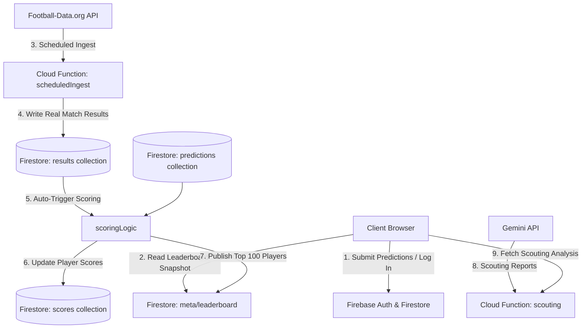

# ⚽ Beat the Oracle ("Beat the Machine")

An interactive tournament bracket prediction and simulation game built with **Vite, Vanilla CSS, Firebase Firestore**, and powered by **Google Cloud Run** and the **Gemini API**. 

Players can simulate matches using Elo-based probabilities, lock in their prediction brackets before the tournament starts, and track their scores live against **The Oracle**—a benchmark bot that always picks the favorite.

---

## 🗺️ System Architecture

The application is built on a highly-scalable, serverless event-driven architecture utilizing Google Cloud and Firebase:



---

## 🎯 Scoring System

Once the tournament is **Locked & Live**, every player's predictions are compared against real-world results:

| Action | Points Awarded | Condition |
| :--- | :--- | :--- |
| **Correct Match Prediction** | **+10 Points** | Predicted team qualifies (groups) or wins (knockouts) in the real world. |
| **Defiance (Group Upset)** | **+20 Points** | Real-world qualifier was an underdog that you picked, but the Oracle missed. |
| **Defiance (Knockout Upset)** | **+25 Points** | Real-world match winner was an underdog that you picked, but the Oracle missed. |

* **Total Score:** `Points + Defiance`. 
* **The Oracle's Role:** Since the Oracle always picks the favorite based on Elo, beating it requires predicting key upsets ("Defiance") and outsmarting the statistical favorite.

---

## 🗄️ Firestore Collections

The database is structured into six optimized collections:

* `users/{uid}`: Stores basic Google profile metadata (`displayName`, `photoURL`, `email`).
* `predictions/{uid}`: Holds the user's locked-in prediction bracket (`groupPicks`, `koPicks`).
* `scores/{uid}`: Holds current point tallies (`points`, `defiance`, `total`, `rank`) for real-time leaderboard rendering.
* `results/{matchId}`: Stores real-world match outcomes populated by the ingestion scraper.
* `config/tournament`: Tournament metadata (`locked`, `lockAt` deadline).
* `meta/leaderboard`: Real-time compiled **Top 100** human players and the Oracle benchmark.

---

## 🛠️ Local Development

### 1. Prerequisites
Ensure you have Node.js (v20+) and `gcloud` CLI configured.

### 2. Setup Dependencies
Install npm modules in both the root folder and functions directory:
```bash
# Root folder
npm install

# Cloud Functions folder
cd functions
npm install
cd ..
```

### 3. Environment Configuration
Create a `.env` file in the root directory:
```env
VITE_FIREBASE_API_KEY=your-firebase-api-key
```

### 4. Running the Dev Server
Launch the local Vite server:
```bash
npm run dev
```

---

## 🚀 Production Deployment

### 1. Deploy Firestore Security Rules
Deploy compile-safe client rules:
```bash
npx firebase-tools deploy --only firestore:rules --project=project-87d15b7f-7332-458c-a73
```

### 2. Deploy Front-end to Cloud Run
Deploy the frontend container with zero downtime:
```bash
gcloud run deploy beat-the-oracle-frontend --source . --region=us-central1 --allow-unauthenticated
```

---

## 🤖 AI Scouting Reports
When navigating the simulation bracket, users can click **"Consult Gemini"** to call the scouting microservice. This microservice connects to the Gemini API, reading the team's historical stats (wins, ELO, goal differential, conf) and generating a rich, narrative scouting analysis highlighting player forms, team style, and historical context.
